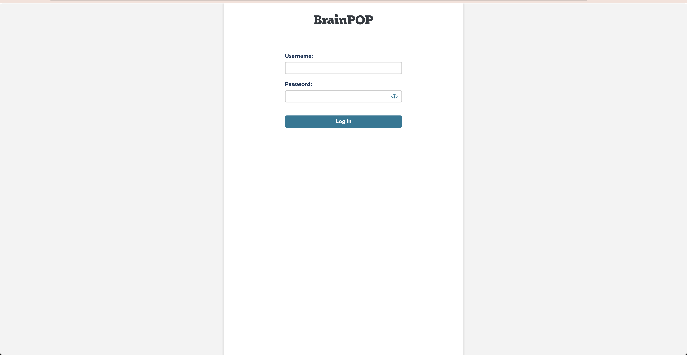
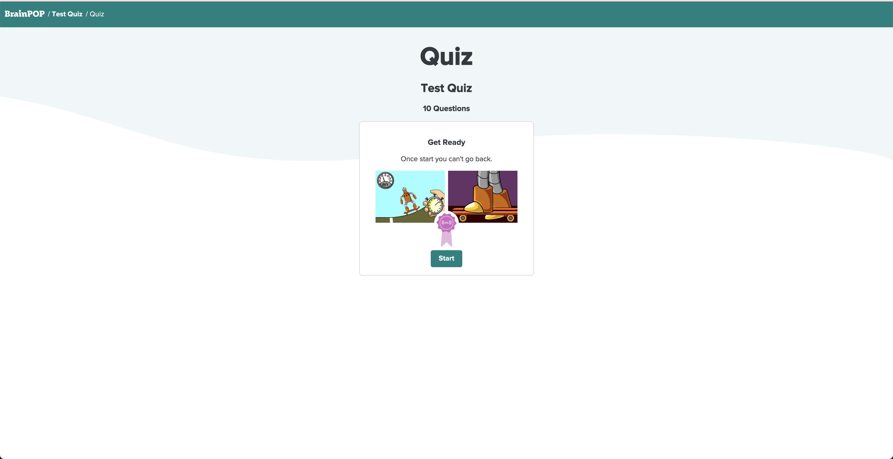
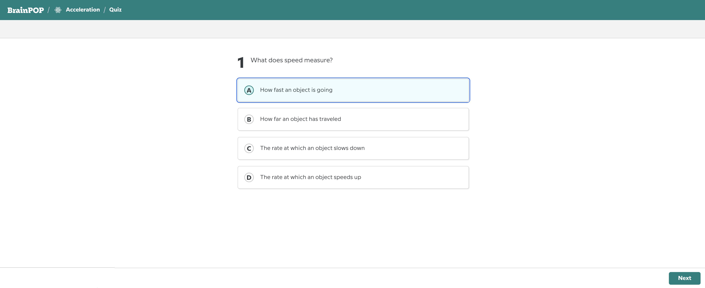
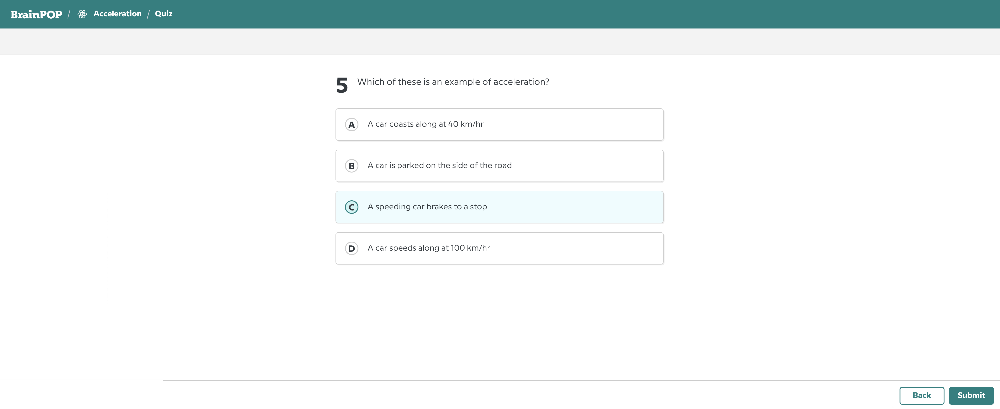
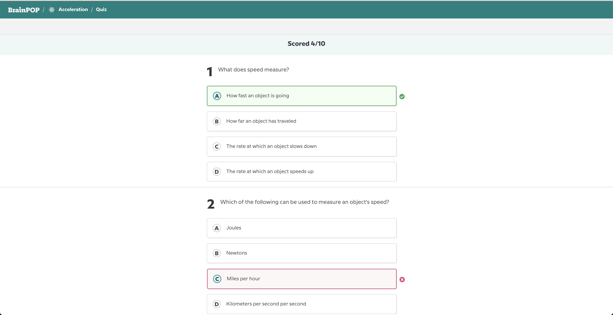

 
 

# TABLE OF CONTENTS

- [Assignment Description](#assignment-description)
- [Guidelines](#guidelines)
- [Requirements](#requirements)
  - [Client](#client)
  - [Server](#server)
- [Environment Setup](#environment-setup)
- [Screenshots](#screenshots)

# Assignment Description

Build a web application where users can take a quiz. The quiz consists of 5 questions, each with multiple-choice options. For each question, users can select only one answer, and only one of the provided options is the correct answer.

Here’s how users will navigate through the application:

1. **Log in:** Users start by logging into the application.
2. **Start Quiz:** Once logged in, they'll be directed to a page where they can see the quiz's details and begin the quiz by clicking a "Start" button.
3. **Take the Quiz**: They'll then proceed to answer all 5 questions, with each question displayed on a separate page. **Important**: Users can only access the next question after they have answered the current one. Navigation between answered questions is accessible using the Back and Next buttons.
4. **Complete the Quiz:** After answering all questions, users can click on a "Submit" button to send their answers for review.
5. **View Results:** Upon completion, users will see a summary of their quiz results, including which answers they got right and their overall score. **Important**: The results displayed must reflect the answers submitted during the current attempt.

([Screenshots](#screenshots) for the described flow are provided below)

The app must contain a frontend, a backend and database components.

# Guidelines

### General Guidelines

- In this repository we provide you with the basic app, using Vue 3, Laravel 10 and Sqlite. Please build on top of it.
- Design matters! Please adhere closely to the design shown in the [screenshots](#screenshots).
- Keep your code clean and tidy.
- Documentation and tests are appreciated and makes the evaluation a lot easier.

### Pre-Built Components

- **Client**: [Login](#login-screen) and [Quiz start](#quiz-start-screen) screen pages.
- **Server**: Login endpoint (`/api/login`)
- **Database**: SQLite, containing an empty `users` table.

# Requirements

### Client

- Make sure all client pages communicates with the server (including the [Pre-Built Components](#pre-built-components)).
- Implement the UI for the [Quiz](#quiz-screen) and the [Summary](#quiz-summary-screen) pages.
  Assets for the application can be found under the **client/src/assets** directory.

### Server

- Implement the following APIs with their respective database structure:
  - Get quiz
  - Store user answers
  - Get user answers

# Environment Setup

### Prerequisites

- [Node.js](https://nodejs.org/en)
- [PHP 8.1](https://www.php.net/manual/en/install.php)
- [Composer](https://getcomposer.org/doc/00-intro.md)

### Installation

#### Mac/Linux

- Navigate to the project server using your preferred terminal and execute `make all`

#### Windows

- Navigate to the project server using your preferred terminal and execute `run.bat`

This will host the following URLs:

- Client: http://localhost:8080
- Server: http://localhost:3000

# Screenshots

### Login screen

### Quiz Start Screen

### Quiz Screen

##### Pagination (Next)

##### Pagination (Back and Submit)

### Quiz Summary Screen

---

### Good Luck!
